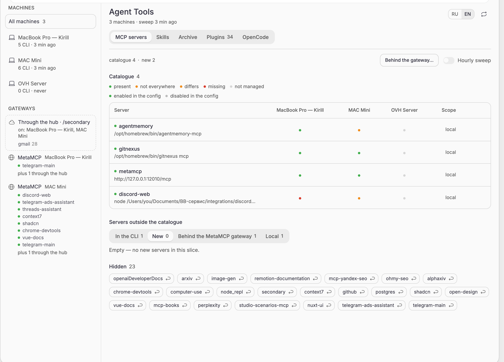
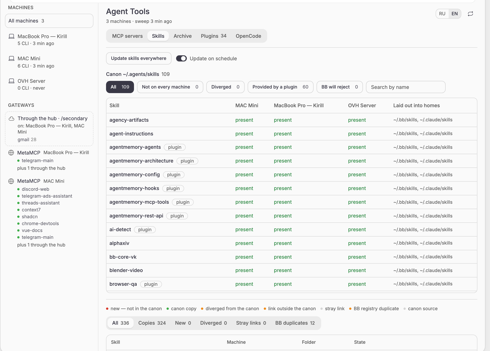
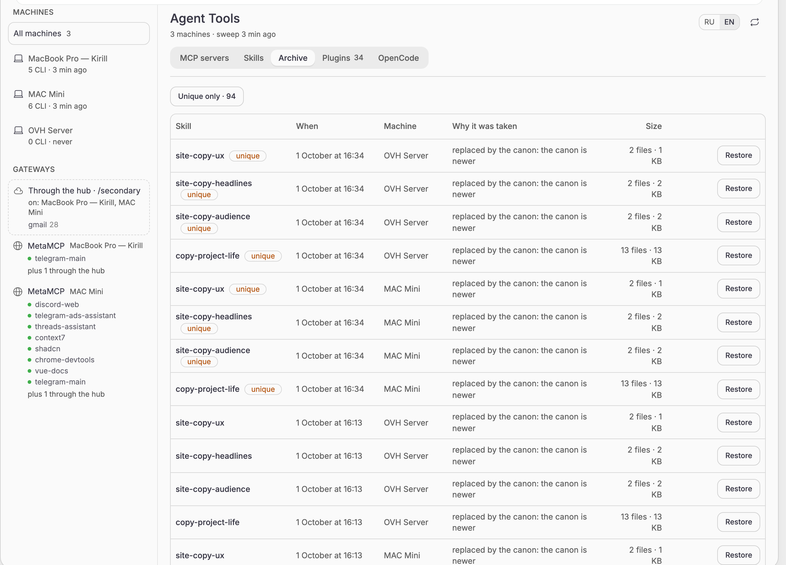
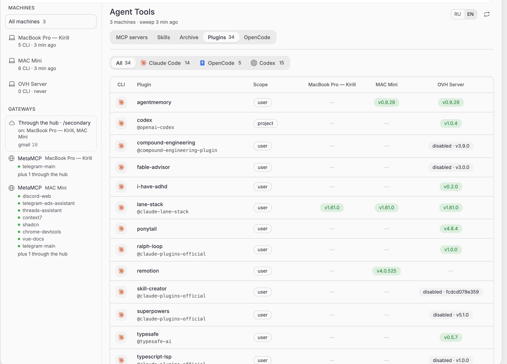
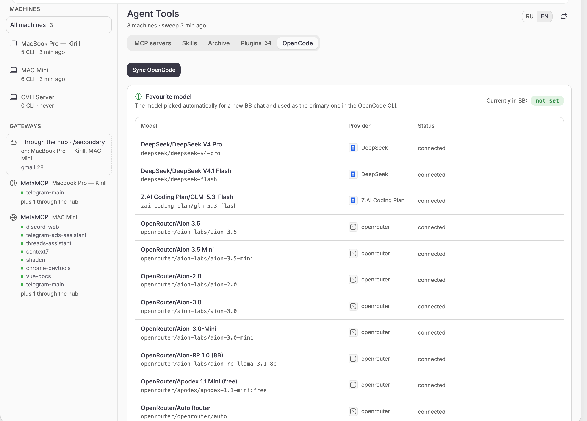

# Agent Tools for BB

**One inventory of MCP servers and agent skills across every machine connected to [BB](https://getbb.app).** See what is configured where, find what is missing or has drifted, and bring every machine to one MCP catalogue and one skills canon without editing config files by hand.



## Why it exists

If you run coding agents on more than one machine (a laptop, a home server, a VPS), their tools drift apart quickly:

- Claude Code on the laptop has twelve MCP servers, Codex on the server has five of them, and OpenCode has a different set again. Each CLI keeps its own config in its own format: `~/.claude.json`, `~/.codex/config.toml`, `opencode.json`, `~/.gemini/settings.json`, and so on.
- Skills sit in five different folders (`~/.agents/skills`, `~/.claude/skills`, `~/.bb/skills`, `~/.qwen/skills`, …). Some are copies, some are symlinks, some are newer on one machine and older on another, and nobody remembers which copy is the real one.
- Adding a server everywhere means opening every config on every machine, in every format.

Agent Tools runs a small trusted entry on each BB machine. It reads those configs and folders, and the BB server combines the results into one picture. From that page you decide what the shared standard is, and the plugin writes it back carefully, with backups and without touching settings it does not model.

## What you get

### MCP servers: one catalogue, a server × machine matrix

- **Matrix view.** Every catalogue server is a row and every machine (or every CLI on the selected machine) is a column. Each cell is marked *present*, *not everywhere*, *differs*, *missing*, or *not managed*, and the config's enabled or disabled flag shows next to it.
- **New servers wait for a decision.** A server found in any CLI but absent from the catalogue lands in *Servers outside the catalogue*. You adopt it as a global standard, keep it local to that machine, or hide it.
- **Sync that only adds.** *Sync* writes missing catalogue servers into every eligible CLI on the selected machine or on all of them. The optional hourly sweep does the same automatically. Neither one ever deletes anything; removal is a separate, confirmed action (`bb tools remove`).
- **Machine-bound servers stay put.** Entries with absolute paths, loopback URLs (`127.0.0.1`), or `${SECRET}` references are marked *local* and are never rolled out to other machines.
- **Live probe.** `bb tools probe` performs a real MCP handshake against configured servers and keeps the latest results.
- **MetaMCP gateways.** With a gateway URL and API key the plugin lists which servers sit behind each MetaMCP namespace, so a server reached through the gateway is not reported as missing. You can also import servers behind the gateway from a JSON file.

Supported CLIs: Claude Code, Codex, OpenCode, Cursor, Antigravity, Gemini CLI, Qwen Code, Kimi CLI, Grok CLI, MimoCode, Crush, plus local MetaMCP gateway configs. Other detected CLIs (`aider`, `amp`, `copilot`, `droid`, `goose`) are listed in the machine inventory as read-only.

### Skills: one canon in `~/.agents/skills`



- **The canon is the source of truth.** `~/.agents/skills` on each machine is the canon. Its matrix shows every skill against every machine and the CLI homes it was laid out into. Filters show what is *not on every machine*, what has *diverged*, what a *plugin provides*, and what *BB will reject* (BB refuses a skill tree over 10 MB or 1000 files).
- **Out-of-canon folders are sorted for you.** Every skill folder outside the canon is classified as *new* (not in the canon yet), *canon copy*, *diverged from the canon*, *link outside the canon*, *stray link*, or *BB registry duplicate*, and each state comes with the action that resolves it.
- **"Update skills everywhere".** One button promotes the newest version of each skill into the canon, syncs the canon over your own git remote, and lays it out into each CLI home. Claude Code and Qwen get symlinks, BB gets a real mirror copy (in `~/.bb/skills` and in the BB server's data directory, where `$` skills are read), and CLIs that read the canon themselves get nothing. It can also run on a schedule.
- **Dependency junk stays home.** `node_modules`, `.venv`, `__pycache__`, `.cache` and similar folders are never copied between machines or committed to the canon.

### Archive: every replaced skill is kept



Before anything overwrites or removes a skill folder, the plugin takes a snapshot. The *Archive* tab lists snapshots by machine, time, and reason, marks snapshots whose content exists nowhere else as *unique*, and restores any of them into the canon with one click.

### CLI plugins and OpenCode



- **Plugins** shows the plugins installed in Claude Code, OpenCode, and Codex on every machine, with scope, version, and whether each one is enabled.
- **OpenCode** compares providers and models between machines, picks the favourite model used by new BB chats and the OpenCode CLI, and syncs the provider configuration.



## How it works

```
 ┌──────────────── BB server ─────────────────┐
 │ server.ts: catalogue, drift, plans, sync,  │
 │ hourly sweep, RPC, `bb tools` CLI          │
 │ app.tsx:   the Agent Tools page            │
 └──────┬──────────────┬──────────────┬───────┘
        │ host RPC     │              │
 ┌──────▼─────┐ ┌──────▼─────┐ ┌──────▼─────┐
 │ host.ts    │ │ host.ts    │ │ host.ts    │
 │ laptop     │ │ home server│ │ VPS        │
 │ reads and  │ │            │ │            │
 │ writes CLI │ │            │ │            │
 │ configs and│ │            │ │            │
 │ skill dirs │ │            │ │            │
 └────────────┘ └────────────┘ └────────────┘
```

1. The server lists the machines enrolled in BB and asks each connected one to **scan**. The host entry finds installed CLIs, parses their MCP configs (JSON, JSONC, or TOML), and fingerprints skill folders.
2. The server normalizes every entry into one model, compares it with the stored catalogue, and computes drift: what is missing, what differs, what is new.
3. You decide: adopt, keep local, hide, sync, remove, or roll skills out. Every action can run as a dry run first (`--dry-run`).
4. The host applies the plan to its own files and reports per-operation results. A machine that fails or does not answer within 25 seconds is reported as an error, never as "nothing to do".

### Safety rules for writing your configs

The plugin edits personal files on your machines, so the write path is strict:

- **Backup first.** Every write creates `*.bak-bb-mcp-<time>` next to the file, and the last five are kept.
- **Atomic writes.** The new content goes to a temporary file that is renamed into place. File permissions are preserved.
- **Merge, never replace.** Updating a server merges the modeled fields into the existing entry, so fields the plugin does not know about (`tool_timeout_sec`, `bearer_token_env_var`, `cwd`, CLI-specific flags) survive.
- **Codex TOML is edited as text.** Comments, section order, and unrelated settings in `config.toml` stay intact.
- **Commented files are read-only.** `opencode.jsonc` and other JSON with comments are scanned but never rewritten.
- **No guessed paths.** A config file is only created where the path is confirmed for that CLI; otherwise the plugin writes only into a file that already exists.
- **Additive by default.** Sync and the hourly sweep only add. Deleting a server from machines is always an explicit command.
- **MetaMCP is read-only.** Change the gateway's composition in MetaMCP itself.

## Requirements

- BB `>= 0.43` with the Plugin SDK `>= 0.4.87`.
- Every machine you want to manage enrolled in BB and connected. Disconnected machines are skipped and listed as such.
- Optional: a git remote for the skills canon (the *Skills: canon git remote* setting) to move skills between machines. Without it, each machine's canon is managed locally.
- Optional: a MetaMCP gateway URL and API key to see servers behind the gateway.

## Install

From the BB plugin marketplace: search for **Agent Tools** and install it.

From source:

```sh
git clone https://github.com/VKirill/bb-plugin-agent-tools.git
cd bb-plugin-agent-tools
npm ci
bb plugin build .
bb plugin install .
```

Then open the **Agent Tools** page in the BB sidebar. The badge on it counts new servers and drift.

## Settings

| Setting | Default | What it does |
| --- | --- | --- |
| MetaMCP: address | empty | Gateway URL used to list servers behind it |
| MetaMCP: API key | empty | Sent as `X-API-Key` to the gateway |
| MetaMCP: namespaces | `secondary` | Comma-separated namespaces to read |
| Skills: update on schedule | off | Run the skills rollout in the hourly sweep |
| Skills: fan out names that plugins already provide | on | Include skills that BB plugins already ship |
| Skills: canon git remote | empty | Remote that the canon on every machine syncs with |

The hourly MCP sweep has its own toggle on the page (*Hourly sweep*) and in the CLI (`bb tools auto on|off`). The interface and CLI output speak Russian and English: use the RU/EN switch on the page or `bb tools lang ru|en`.

## CLI

Everything on the page is also available as `bb tools`, so agents can use it too. The plugin ships an `agent-tools` skill that teaches them how.

```text
bb tools status [--json]                    Catalogue, machines, drift
bb tools scan [--host <id>]                 Rescan machines
bb tools catalog [--json]                   Catalogue entries
bb tools pending [--json]                   New servers not adopted yet
bb tools adopt <name...>                    Adopt servers into the catalogue
bb tools ignore|unignore <name...>          Hide a server or bring it back
bb tools plan [--host <id>]                 What a sync would change
bb tools sync [--host <id>] [--dry-run] [--with-different]
bb tools forget <name>                      Drop a catalogue entry, keep machine configs
bb tools remove <name> [--with-gateways]    Remove a server from every machine
bb tools probe [<name>]                     Live MCP handshake
bb tools enable|disable <name>              Toggle a server in the configs
bb tools auto on|off                        Hourly automatic sync
bb tools gateway-add <file.json> --host <id>  Add servers behind a MetaMCP gateway
bb tools skills [--host <id>] [--canon]     Skills outside the canon, or the canon itself
bb tools skills-adopt <folder> <name> --host <id> [--link|--delete|--take|--unlink]
bb tools skills-fanout [--host <id>] [--dry-run] [--all]
bb tools skills-sync [--host <id>]          Sync the canon with its git remote
bb tools skills-backups [--host <id>] [--json]
bb tools skills-restore <snapshot-id> --host <id>
bb tools plugins [--json]                   CLI plugins by machine
bb tools lang [ru|en]                       Interface and output language
```

## Development

```sh
npm ci
npm run typecheck
npm test
bb plugin build .
bb plugin reload agent-tools
```

| File | Responsibility |
| --- | --- |
| `agents.ts` | Table of supported CLIs: binaries, config paths, dialect. A new CLI is added here only. |
| `normalize.ts` | Dialect ⇄ common server model, comparison, machine-bound detection |
| `toml-mcp.ts` | Text-preserving read and edit of `[mcp_servers.*]` in TOML |
| `skills.ts` | Skill states, per-folder policy, deterministic rollout planning |
| `skills-sync.ts`, `skills-server.ts`, `skill-tree.ts` | Git sync of the canon, the BB server mirror, clean tree copies |
| `host.ts` | Trusted per-machine entry: scanning and writing configs |
| `server.ts` | Catalogue, drift, plans, sync, schedule, RPC, `bb tools` CLI |
| `app.tsx` | The Agent Tools page |
| `contract.ts` | Shared Zod schemas for RPC between server, hosts, and UI |

Deeper documentation lives in [docs/](docs/index.md): [architecture](docs/architecture.md), [MCP catalogue](docs/features/mcp-catalog.md), [skills](docs/features/skills.md), [OpenCode](docs/features/opencode.md), [CLI plugins](docs/features/cli-plugins.md), [API and commands](docs/api.md), [data model](docs/data-model.md), [gotchas](docs/gotchas.md), and [decisions](docs/decisions.md). Release notes are in [CHANGELOG.md](CHANGELOG.md).

## Author

Kirill Vechkasov ([@VKirill](https://github.com/VKirill)).

## License

MIT. See [LICENSE](LICENSE).
