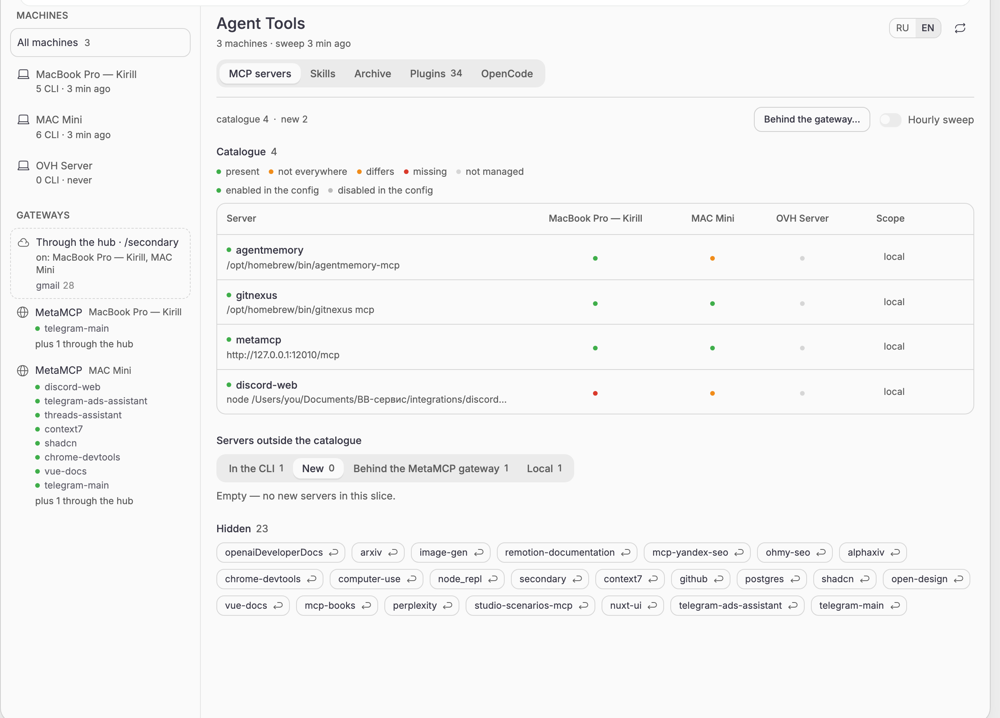

# Agent Tools for BB

Agent Tools is a BB plugin for agent skills and MCP servers across connected machines. Skills live on the BB server hub, which BB exposes to sessions (`hub-skills.ts:8-12`). The plugin organizes hub skills into categories, validates skills and tracks Git history (`skills-hub-service.ts:283-309`, `hub-skills.ts:276-357`), copies skills missing from the hub from machine folders (`skills-hub-service.ts:593-609`), and lets operators enable a cleanup button for machine folders (`settings-page.tsx:180-199`). For MCP servers, CLI plugins and OpenCode providers it keeps an editable catalogue and syncs machines to it.



## Install

In BB, search the plugin marketplace for **Agent Tools**. To install from source:

```sh
git clone https://github.com/VKirill/bb-plugin-agent-tools.git
cd bb-plugin-agent-tools
npm ci
bb plugin build .
bb plugin install .
```

Open the **Agent Tools** page in the BB sidebar. The interface and CLI support Russian and English; the page follows BB’s interface language, and the CLI language is set with `bb tools lang ru|en`.

## Documentation

- [Overview](docs/overview.md) and [architecture](docs/architecture.md)
- Features: [MCP catalogue](docs/features/mcp-catalog.md), [hub skills and categories](docs/features/skills-hub.md), [legacy machine skills](docs/features/skills.md), [CLI plugins](docs/features/cli-plugins.md), and [OpenCode](docs/features/opencode.md)
- [API and commands](docs/api.md), [deployment](docs/deployment.md), [data model](docs/data-model.md), and [gotchas](docs/gotchas.md)
- [Release notes](CHANGELOG.md)
