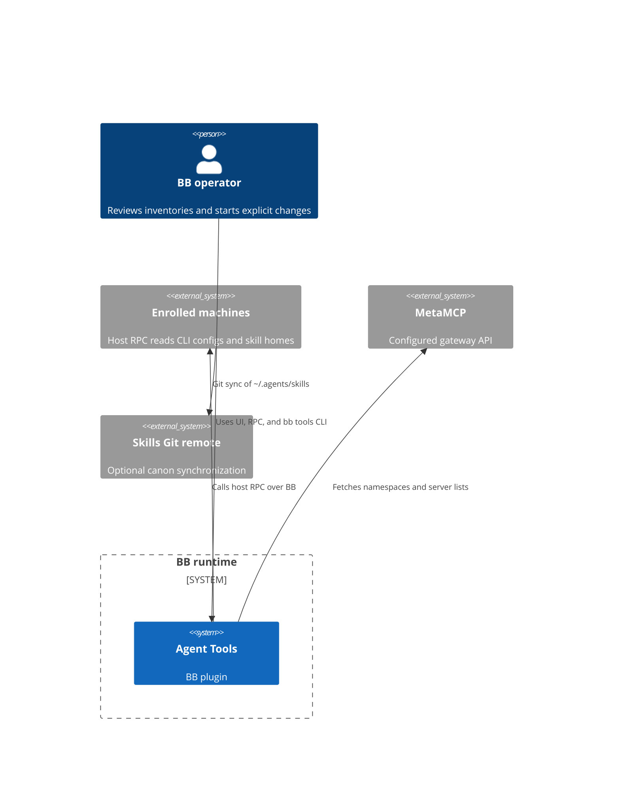
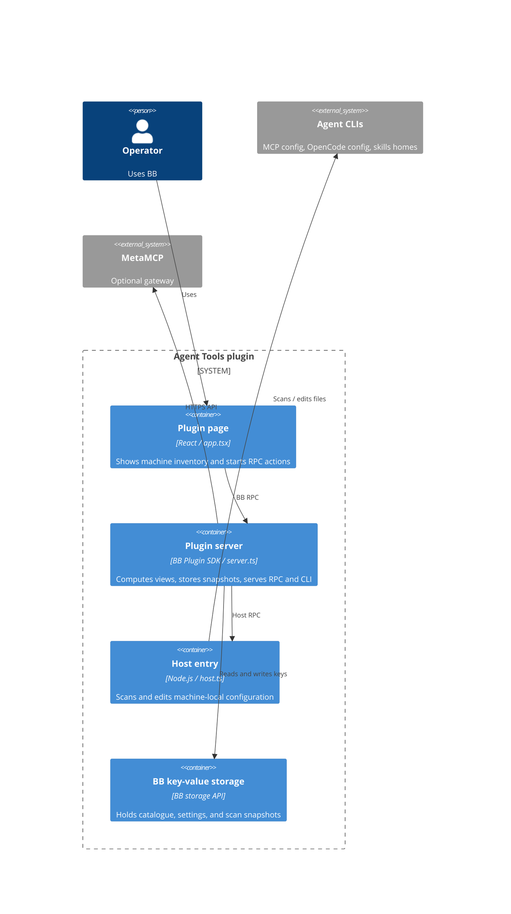
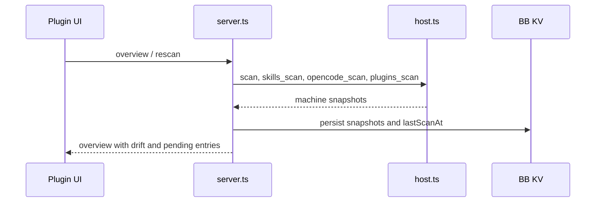
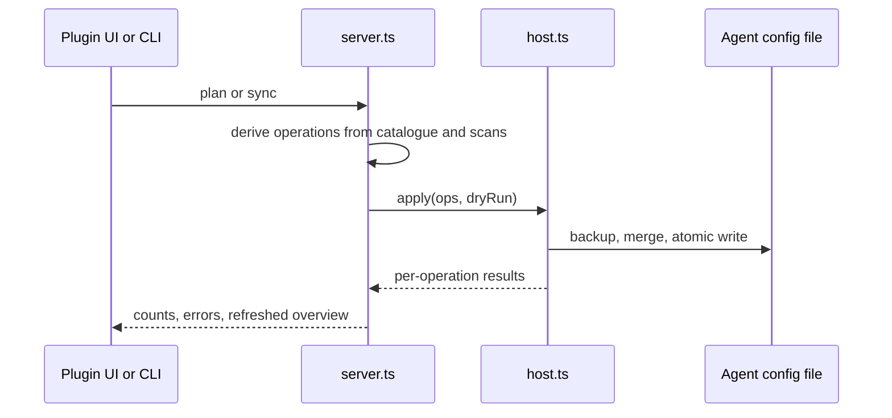
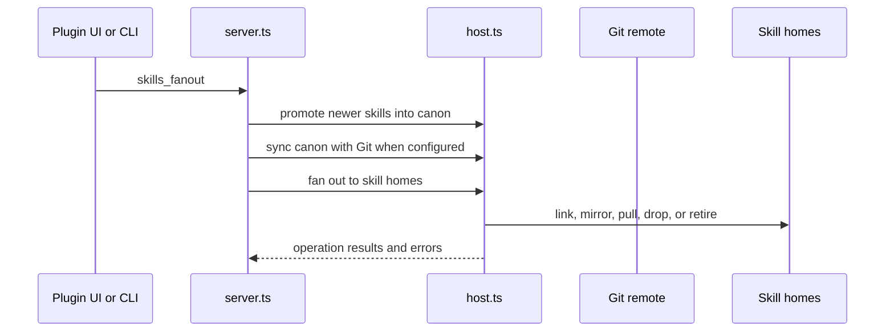

# Agent Tools architecture
The server coordinates BB UI/CLI requests, host RPC calls, local configuration changes, and stored scan snapshots (`server.ts:465-525`, `host.ts:998-1000`).

## System context

A BB operator uses the plugin through the BB plugin UI or `bb tools`; the plugin calls BB host RPC on connected machines, reads BB provider/model metadata, and optionally calls a configured MetaMCP gateway (`server.ts:520-521`, `server.ts:635-649`, `server.ts:995-1023`).

Diagram evidence: plugin entry points and host client (`server.ts:465-521`); host entry (`host.ts:998-1000`); optional MetaMCP settings and fetch flow (`server.ts:473-515`, `server.ts:635-649`); Git operations (`host.ts:112-120`, `host.ts:158-217`).

## Containers

The manifest points BB to `app.tsx`, `server.ts`, and `host.ts` (`package.json:28-38`). The UI calls RPC methods through the server (`app.tsx:114-138`); the server creates a host client and uses BB KV (`server.ts:520-525`); the host performs file operations (`host.ts:435-483`).

## Building blocks

- `agents.ts` defines CLI config paths, dialects, providers, and path confirmation (`agents.ts:5-47`, `agents.ts:56-219`).
- `normalize.ts`, `toml-mcp.ts`, `opencode.ts`, and `probe.ts` translate, compare, edit, and check agent configuration (`server.ts:8-19`, `host.ts:14-19`).
- `contract.ts` defines validated server RPC and host RPC methods and data shapes (`contract.ts:348-436`, `server.ts:201-434`).
- `skills.ts` computes skill states and deterministic promotion/fan-out plans (`skills.ts:103-190`, `skills.ts:267-330`, `skills.ts:409-525`).
- `server.ts` owns cross-machine orchestration, state, CLI registration, and hourly sweep (`server.ts:465-525`, `server.ts:1854-2088`, `server.ts:2153-2166`).
- `host.ts` owns machine-local scans, backups, and writes (`host.ts:435-483`, `host.ts:596-653`, `host.ts:998-1000`).
- `app.tsx` renders the machine selector and MCP, skills, archive, plugins, and OpenCode tabs (`app.tsx:3266-3337`).

## Key flows

### Scan and catalogue view

The scan sequence calls four host methods and persists each returned scan (`server.ts:543-598`).

### Apply MCP sync

The server plans and dispatches changes (`server.ts:1098-1150`, `server.ts:1400-1451`); the host backs up and writes files atomically (`host.ts:435-483`, `host.ts:1341-1369`).

### Skills rollout

The rollout sequence promotes candidates, synchronizes Git, then fans out with per-machine results (`server.ts:1289-1364`, `skills.ts:267-330`, `skills.ts:409-525`).

## Invariants

- A machine appears in a scan target set only when BB reports it connected (`server.ts:555-564`).
- MCP write eligibility requires an installed, non-gateway, writable agent with an existing config or confirmed path (`server.ts:652-665`).
- A catalogue entry is rolled out only when its scope is `global` and its target list is empty or includes that agent kind (`server.ts:668-671`).
- Failed host scans are retained as error snapshots; skill/OpenCode/plugin scan failures are logged and surfaced through their area state (`server.ts:543-553`, `server.ts:565-598`).
- Config writes take a backup and use a temporary file followed by rename (`host.ts:435-463`).
- The skills fan-out schedule is controlled by user settings; canon fan-out defaults to disabled (`server.ts:493-507`, `server.ts:2068-2087`).

## Cross-cutting concerns

**Validation.** Zod schemas bound RPC inputs and output shapes; `rpcContract` and `hostContract` define the server/host interfaces (`contract.ts:348-436`, `server.ts:201-434`).

**Errors.** Host RPC rejections are recorded on MCP scan snapshots, while writes return per-operation errors; skill bulk actions preserve failures in their response (`server.ts:543-553`, `host.ts:1315-1369`, `server.ts:1930-1960`).

**Language.** UI and CLI strings pass through the shared language functions; the selected language is persisted in BB KV (`i18n.ts:8-69`, `server.ts:469-471`, `server.ts:1962-1967`).

See [API](api.md), [data model](data-model.md), and the [feature pages](features/mcp-catalog.md).

<!-- lane-pilot:backlinks -->
## Referenced by

- [Agent Tools deployment](deployment.md)
- [CLI plugin inventory](features/cli-plugins.md)
- [Agent Tools overview](overview.md)
