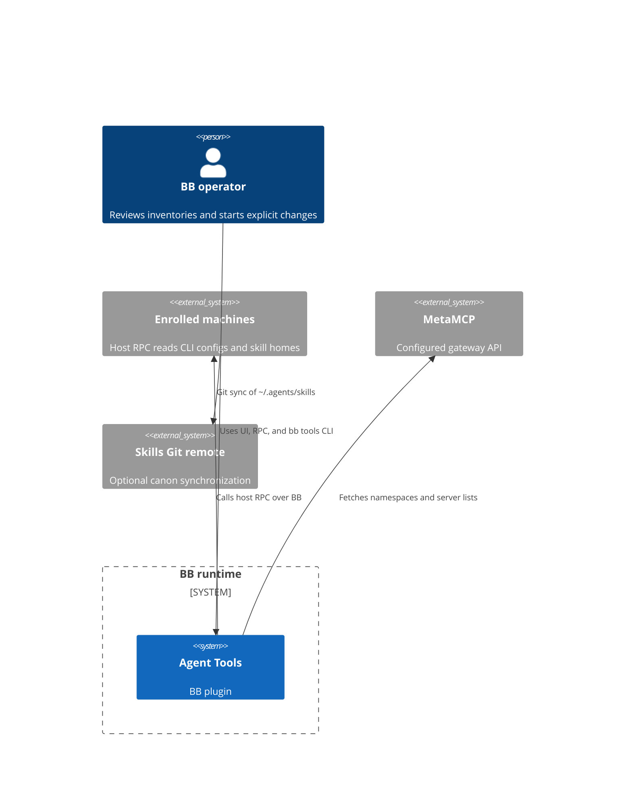
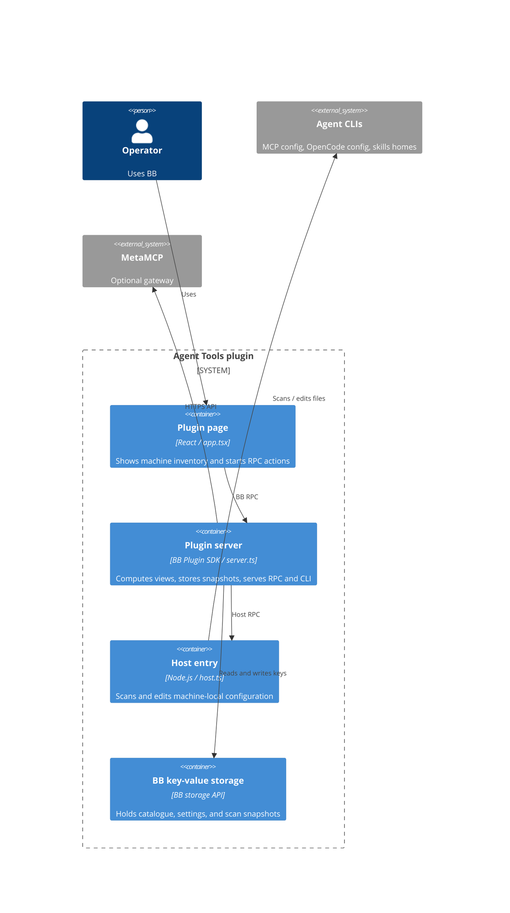
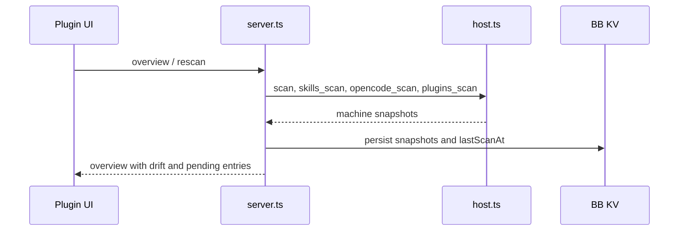
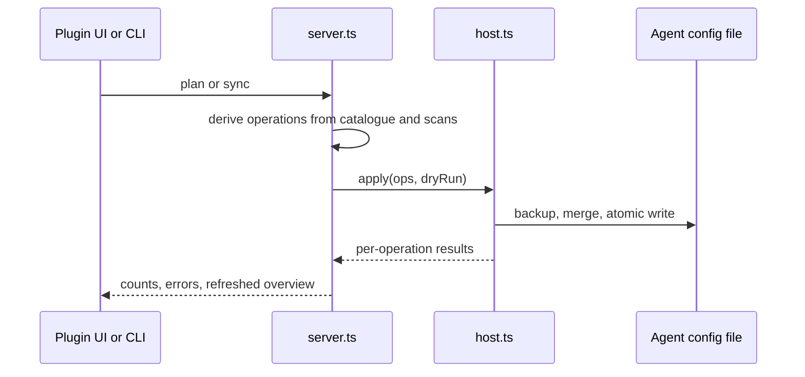
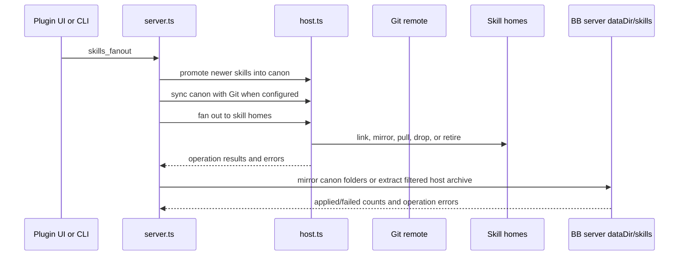

# Agent Tools architecture
The server coordinates BB UI/CLI requests, host RPC calls, local configuration changes, and stored scan snapshots (`server.ts:479-525`, `host.ts:783-785`).

## System context

A BB operator uses the plugin through the BB plugin UI or `bb tools`; the plugin calls BB host RPC on connected machines, reads BB provider/model metadata, and optionally calls a configured MetaMCP gateway (`server.ts:520-521`, `server.ts:635-649`, `server.ts:995-1023`).

Diagram evidence: plugin entry points and host client (`server.ts:465-521`); host entry (`host.ts:783-785`); optional MetaMCP settings and fetch flow (`server.ts:487-525`, `server.ts:635-649`); canon Git operations (`skills-sync.ts:87-236`); server-process skill directory (`server.ts:1361-1383`, `skills-server.ts:58-64`).

## Containers

The manifest points BB to `app.tsx`, `server.ts`, and `host.ts` (`package.json:28-38`). The UI calls RPC methods through the server (`app.tsx:114-138`); the server creates a host client and uses BB KV (`server.ts:520-525`); the host entry performs file operations (`host.ts:783-785`, `host.ts:213-241`, `host.ts:1118-1189`).

## Building blocks

- `agents.ts` defines CLI config paths, dialects, providers, and path confirmation (`agents.ts:5-47`, `agents.ts:56-219`).
- `normalize.ts`, `toml-mcp.ts`, `opencode.ts`, and `probe.ts` translate, compare, edit, and check agent configuration (`server.ts:8-19`, `host.ts:14-19`).
- `contract.ts` defines validated server RPC and host RPC methods and data shapes (`contract.ts:355-452`, `server.ts:201-448`).
- `skills.ts` computes skill states and deterministic promotion/fan-out plans (`skills.ts:103-190`, `skills.ts:267-330`, `skills.ts:409-525`).
- `skills-sync.ts` reconciles the canon with its Git remote, adds ignore patterns for link names and dependency/cache directories, and preserves colliding local skill folders during an untracked-file overwrite recovery (`skills-sync.ts:87-232`).
- `skills-server.ts` scans, backs up, copies, and extracts filtered skill trees in the BB server process's `dataDir/skills` (`skills-server.ts:58-64`, `skills-server.ts:66-100`, `skills-server.ts:102-145`); `skill-tree.ts` defines excluded junk and BB tree measurement (`skill-tree.ts:12-29`, `skill-tree.ts:32-70`).
- `server.ts` owns cross-machine orchestration, state, CLI registration, and hourly sweep (`server.ts:479-525`, `server.ts:2055-2288`, `server.ts:2290-2373`).
- `host.ts` owns machine-local scans, backups, and writes (`host.ts:151-241`, `host.ts:374-435`, `host.ts:783-818`, `host.ts:1118-1189`).
- `app.tsx` renders the machine selector and MCP, skills, archive, plugins, and OpenCode tabs (`app.tsx:3266-3337`).

## Key flows

### Scan and catalogue view

The scan sequence calls `scan`, `skills_scan`, `opencode_scan`, and `plugins_scan` for each connected target and persists each successful result in its host-keyed snapshot; the main MCP scan also stores a failure string when the host call rejects (`server.ts:558-567`, `server.ts:569-612`).

### Apply MCP sync

The server plans and dispatches changes (`server.ts:1120-1154`, `server.ts:1606-1651`); the host backs up and writes files atomically (`host.ts:213-241`, `host.ts:1118-1189`).

### Skills rollout

The rollout sequence scans, promotes candidates, synchronizes Git when configured, fans out to connected host homes, then plans and writes mirrors in the BB server process's data directory (`server.ts:1538-1569`, `server.ts:1361-1532`, `skills.ts:267-330`, `skills.ts:409-525`, `skills.ts:582-612`). When a planned server-process mirror is missing from the local canon, the rollout selects a connected host canon and requests a packed skill archive from that host (`server.ts:1412-1453`, `server.ts:1488-1503`, `host.ts:1086-1115`).

## Invariants

- A machine appears in the scan target set only when BB reports it connected (`server.ts:569-578`).
- MCP write eligibility requires an installed, non-gateway, writable agent with an existing config or confirmed path (`server.ts:673-680`).
- A catalogue entry is rolled out only when its scope is `global` and its target list is empty or includes that agent kind (`server.ts:682-685`).
- Failed host scans are retained as error snapshots; skill/OpenCode/plugin scan failures are logged and surfaced through their area state (`server.ts:543-553`, `server.ts:565-598`).
- Config writes take a backup and use a temporary file followed by rename (`host.ts:213-241`).
- The skills fan-out schedule is controlled by user settings; canon fan-out defaults to disabled (`server.ts:507-514`, `server.ts:2267-2287`).

## Cross-cutting concerns

**Validation.** Zod schemas bound RPC inputs and output shapes; `rpcContract` and `hostContract` define the server/host interfaces (`contract.ts:355-452`, `server.ts:201-448`).

**Errors.** Host RPC rejections are recorded on MCP scan snapshots, while writes return per-operation errors; skill bulk actions preserve failures in their response (`server.ts:558-567`, `host.ts:1118-1189`, `server.ts:2130-2160`).

**Language.** UI and CLI strings pass through the shared language functions; the selected language is persisted in BB KV (`i18n.ts:8-69`, `server.ts:483-485`, `server.ts:2162-2167`).

See [API](api.md), [data model](data-model.md), and the [feature pages](features/mcp-catalog.md).

<!-- lane-pilot:backlinks -->
## Referenced by

- [Agent Tools deployment](deployment.md)
- [CLI plugin inventory](features/cli-plugins.md)
- [Agent Tools overview](overview.md)
