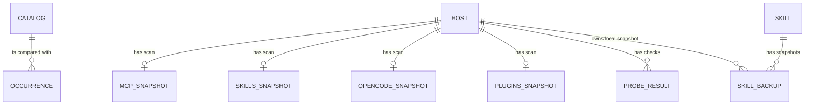

# Agent Tools data model
The plugin stores its catalogue, preferences, probe results, and per-host scan snapshots in BB key-value storage; machine-owned configs and skill archives remain files on their host (`server.ts:522-598`, `host.ts:435-498`).

## Schema overview

The diagram's `OCCURRENCE` is computed from scans, not a persisted collection; catalogue entries and per-host scan families are the persisted inputs (`contract.ts:441-480`, `server.ts:436-463`, `server.ts:601-628`, `host.ts:521-537`).

## BB key-value collections

### `catalog` — desired MCP server definitions

Written by adoption and catalogue update/removal/sync commands; read by overview, drift, and plan (`server.ts:523-525`, `server.ts:1892-1910`, `server.ts:2077-2109`).

| Field | Meaning |
|---|---|
| `name` | Server key; non-empty, maximum 120 characters (`contract.ts:457-467`). |
| `spec` | Normalized MCP definition: transport, command/args/env or URL/headers, and optional disabled state (`contract.ts:5-19`). |
| `scope` | `global` participates in rollout; `local-only` stays outside desired-state sync (`contract.ts:461-463`, `server.ts:682-685`). |
| `targets` | Agent kind allowlist; empty means all managed agent kinds (`contract.ts:463-464`, `server.ts:682-685`). |
| `origin` | Source machine ID and CLI kind, or null (`contract.ts:464`). |
| `updatedAt` | Unix epoch milliseconds for last catalogue mutation (`contract.ts:465`, `server.ts:2081-2085`). |

Primary key: `name` by application convention; the schema is an array and adoption appends entries (`server.ts:1892-1910`).

### `ignored` — suppressed pending names

A string array of server names. `ignore` adds names and `unignore` removes them; pending calculation omits ignored names (`server.ts:540-541`, `server.ts:706-746`, `server.ts:2065-2076`). The key is the fixed KV key `ignored`; there is no separate row ID.

### `snapshot:<hostId>` — MCP host scan

One record per BB host ID. `Snapshot` stores `hostId`, `hostName`, nullable `scan`, nullable `error`, and `at`; both timestamps are Unix epoch milliseconds (`server.ts:450-456`, `server.ts:558-567`). On host-call failure, `scan` remains null and `error` receives the failure text. On success, `scan` contains `hostname`, `platform`, `home`, nested `scannedAt`, `agents`, and `otherClis` (`server.ts:558-567`, `contract.ts:36-45`). Each agent record has `kind`, `label`, `installed`, `binPath`, `configPath`, `configExists`, `writable`, `gateway`, `servers`, and `warning` (`contract.ts:21-33`). Each server has `name`, `transport` (`stdio`, `http`, `sse`), optional `command`, `args`, `env`, `url`, `headers`, and `disabled` (`contract.ts:5-17`). Each extra CLI record has `bin` and `path` (`contract.ts:41-43`). `scanHost` writes the snapshot; `readSnapshots` supplies overview, drift and planning (`server.ts:547-567`, `server.ts:779-820`). No deletion or expiry path appears in the plugin.

### `skills:<hostId>`, `opencode:<hostId>`, `plugins:<hostId>` — feature scan snapshots

Each record has `hostId`, `hostName`, `scan`, and `at` (`server.ts:458-470`). Skills scan fields include `canonicalPath`, `canonHasGit`, `pluginNames`, and `locations`; each entry has `name`, `kind`, `target`, `hash`, `mtime` in milliseconds, `hasSkillMd`, `bytes` excluding recognized junk for content comparison, `bbBytes` and `bbFiles` measured with junk included, and `junk` indicating a recognized junk directory (`contract.ts:74-112`, `host.ts:405-418`, `skill-tree.ts:32-70`). Connected-host scans write these records and the skills view reads them (`server.ts:569-589`, `server.ts:820-900`). The plugin also maintains a derived mirror under the BB server process's `experimental_dataDir/skills`; it is not the enrolled machine's `~/.bb/skills` home (`server.ts:1361-1383`, `skills-server.ts:58-64`). If a canon skill is absent from the server process's local canon, the rollout can select a connected host canon, call `skills_archive`, and extract the base64 tar into that process directory. The host packs recognized-junk exclusions and refuses archives over 8 MiB; extraction removes the temporary tar even if `tar` fails (`server.ts:1412-1453`, `server.ts:1488-1503`, `host.ts:1086-1115`, `skills-server.ts:130-145`). OpenCode and CLI-plugin scan shapes remain as defined in their contracts (`contract.ts:193-206`, `contract.ts:255-292`). Failed optional scans are logged and do not replace the existing records (`server.ts:580-610`).

### Scalar and bounded-value keys

| KV key | Meaning / fields | Writer and readers |
|---|---|---|
| `lang` | `ru` or `en`; defaults to `ru` when absent or invalid (`server.ts:483-485`, `i18n.ts:6-17`). | UI/CLI setter; read during plugin initialization (`server.ts:483-485`, `server.ts:2162-2167`). |
| `autoSync` | Boolean scheduled MCP sync toggle; absent means false (`server.ts:542-543`). | UI/CLI switch; hourly sweep reads it (`server.ts:2267-2287`). |
| `lastScanAt`, `lastSyncAt` | Unix epoch milliseconds for last scan and sync (`server.ts:612`, `server.ts:1648`, `server.ts:1088-1089`). | Scan/sync orchestration; overview reads. No expiry shown. |
| `probes` | Probe result array keyed by `(hostId, kind, name)` when replacing prior values; fields are `kind`, `name`, `ok`, `tools`, `error`, `durationMs`, and `checkedAt` (epoch milliseconds) (`contract.ts:145-156`, `server.ts:1843-1888`). | Probe writes and overview/CLI reads; array is capped at the latest 400 records (`server.ts:544-545`, `server.ts:1843-1888`). |
| `metamcp` | Cached namespace records with `namespace`, `url`, `servers` (`name`, tool count), `error`, and `fetchedAt` (epoch milliseconds) (`server.ts:631-649`, `metamcp.ts:5-17`). | Gateway refresh; overview reads to preserve data across plugin reloads (`server.ts:631-649`). |

### BB settings

Settings are declared through `bb.settings.define`, outside the plugin KV keys (`server.ts:473-516`). Fields: `metamcpUrl` (string), `metamcpApiKey` (secret string), `metamcpNamespaces` (comma-separated string, default `secondary`), `skillsFanOutAuto` (boolean, default false), `skillsFanOutPluginNames` (boolean, default true), and `skillsSyncRemote` (secret string). `readConfig` reads values at use time (`server.ts:517-520`).

## Host filesystem data

### CLI configuration files

`agents.ts` maps each supported agent kind to a home-relative file, JSON/JSONC/TOML format, config pointer, and dialect (`agents.ts:16-25`, `agents.ts:56-219`). The host reads these files, merges only modeled fields, and rewrites entries during apply (`host.ts:151-210`, `normalize.ts:194-203`, `host.ts:1118-1189`). Backups are adjacent `<file>.bak-bb-mcp-<timestamp>` files; only five are retained, and temp-file rename preserves permissions (`host.ts:213-241`).

### Skill homes, fan-out state, and archive

The scan reads `~/.agents/skills`, Claude, Codex, Gemini, BB, OpenCode, Cursor, and Qwen locations (`host.ts:254-273`). Each entry holds name, kind, target, hash, mtime, and `hasSkillMd`; it also reports content bytes, BB-counted bytes and files, and whether recognized junk directories are present (`host.ts:389-435`, `contract.ts:99-105`). The BB tree measure counts regular files and bytes including junk, records up to five symlink/junk paths, and stops traversal after its scan guard (`skill-tree.ts:32-70`). `~/.agents/skills-fanout.json` stores top-level `at` (ISO timestamp) and `entries[name] = { hash, mirrored? }`, recording previously managed BB mirrors (`skills.ts:342-345`, `skills.ts:507-524`, `host.ts:283-293`, `host.ts:966-975`).

The BB server process keeps user skills under `bb.server.experimental_dataDir/skills`; Agent Tools plans and applies mirrors there separately from host homes. Host archives sent for missing canon entries are base64 tar content with junk excluded and an 8 MiB packed-size ceiling; this payload is transient RPC data rather than a persisted catalogue row (`server.ts:1361-1532`, `skills.ts:582-612`, `host.ts:1086-1115`, `skills-server.ts:58-64`, `skills-server.ts:130-145`).

Skill snapshots live below `~/.agents/skills-backups/<name>/<timestamp>/` with `.backup.json` metadata fields `name`, ISO timestamp `at`, `reason`, `locationId`, `machine`, and content hash (`host.ts:299-315`). The archive reader derives `files`, `bytes`, and `unique` on read (`host.ts:982-1039`). Restore writes snapshot content to the canon and archives current canon content first (`host.ts:1041-1061`). The code has no skill-backup retention cleanup; the reader returns at most 500 rows (`host.ts:982-1039`).

### OpenCode configuration

OpenCode provider/model state is read from `~/.config/opencode/opencode.json` or `opencode.jsonc`; provider fields include ID, display name, package, base URL, API-key-present flag, models, allowlist, and raw provider config (`host.ts:790-851`, `contract.ts:181-206`). JSONC with comments is read-only (`host.ts:802-813`, `host.ts:669-671`). File writes use the same adjacent backup and atomic-write helper (`host.ts:686-697`, `host.ts:435-463`).

### BB SQLite preference row

The plugin directly reads/writes the `project_execution_defaults` table in BB's `~/.bb/bb.db` for provider `acp-opencode`. It reads the model from the row with the greatest `updated_at`; writes update rows or insert one with model, provider, service tier, reasoning level, permission mode, and update timestamp (`server.ts:738-775`). This plugin does not define the table schema. The selection query reads `projects.id` to associate a newly inserted row (`server.ts:766-770`).

## Lifecycle and retention

| Data | Transition / writer | Cleanup |
|---|---|---|
| Catalogue row | Pending adoption → global/local-only; update → changed fields; remove/forget → catalogue row deleted (`server.ts:1691-1710`, `server.ts:1877-1901`). | No age-based cleanup. `forget` leaves host configs unchanged (`server.ts:2365-2375`). |
| MCP snapshots | Scan success or failure writes a fresh snapshot (`server.ts:543-553`). | No plugin cleanup path. |
| Probe results | New result replaces same host/kind/name; newest combined list is truncated to 400 (`server.ts:1681-1688`). | Older probe records beyond that limit are dropped. |
| Config backups | Created before writes; sorted and oldest beyond five are deleted (`host.ts:435-448`). | Keep last five per config file. |
| Skill backups | Created before replacement/deletion; list computes uniqueness and sizes (`host.ts:521-537`, `host.ts:982-1039`). | No cleanup job in this code. |

See [MCP catalogue](features/mcp-catalog.md), [skills](features/skills.md), and [OpenCode](features/opencode.md).

<!-- lane-pilot:backlinks -->
## Referenced by

- [Agent Tools architecture](architecture.md)
- [MCP server catalogue](features/mcp-catalog.md)
- [OpenCode provider and model management](features/opencode.md)
- [Agent skill canon and rollout](features/skills.md)
- [Agent Tools gotchas](gotchas.md)
- [Agent Tools overview](overview.md)
