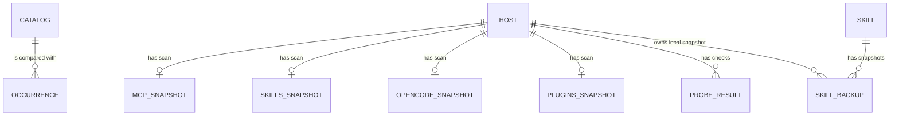

# Agent Tools data model
The plugin stores its catalogue, preferences, probe results, and per-host scan snapshots in BB key-value storage; machine-owned configs and skill archives remain files on their host (`server.ts:522-598`, `host.ts:435-498`).

## Schema overview

The diagram's `OCCURRENCE` is computed from scans, not a persisted collection; catalogue entries and per-host scan families are the persisted inputs (`contract.ts:441-480`, `server.ts:436-463`, `server.ts:601-628`, `host.ts:521-537`).

## BB key-value collections

### `catalog` — desired MCP server definitions

Written by adoption and catalogue update/removal/sync commands; read by overview, drift, and plan (`server.ts:523-525`, `server.ts:1691-1710`, `server.ts:1877-1901`).

| Field | Meaning |
|---|---|
| `name` | Server key; non-empty, maximum 120 characters (`contract.ts:441-450`). |
| `spec` | Normalized MCP definition: transport, command/args/env or URL/headers, and optional disabled state (`contract.ts:5-19`). |
| `scope` | `global` participates in rollout; `local-only` stays outside desired-state sync (`contract.ts:444-447`, `server.ts:668-671`). |
| `targets` | Agent kind allowlist; empty means all managed agent kinds (`contract.ts:446-448`, `server.ts:668-671`). |
| `origin` | Source machine ID and CLI kind, or null (`contract.ts:448-449`). |
| `updatedAt` | Unix epoch milliseconds for last catalogue mutation (`contract.ts:448-450`, `server.ts:1705-1708`). |

Primary key: `name` by application convention; the schema is an array and adoption appends entries (`server.ts:1691-1710`).

### `ignored` — suppressed pending names

A string array of server names. `ignore` adds names and `unignore` removes them; pending calculation omits ignored names (`server.ts:527-528`, `server.ts:692-705`, `server.ts:1865-1876`). The key is the fixed KV key `ignored`; there is no separate row ID.

### `snapshot:<hostId>` — MCP host scan

One record per BB host ID. The snapshot fields are `hostId`, `hostName`, `scan`, `error`, and `at`; `at` and nested `scannedAt` are Unix epoch milliseconds (`server.ts:436-442`, `server.ts:543-553`, `contract.ts:36-45`). `scan` is null on host-call failure. Otherwise it contains `hostname`, `platform`, `home`, `scannedAt`, `agents`, and `otherClis` (`contract.ts:36-45`). Each agent record has `kind`, `label`, `installed`, `binPath`, `configPath`, `configExists`, `writable`, `gateway`, `servers`, and `warning` (`contract.ts:21-33`). Each server has `name`, `transport` (`stdio`, `http`, `sse`), optional `command`, `args`, `env`, `url`, `headers`, and `disabled` (`contract.ts:5-17`). Each extra CLI record has `bin` and `path` (`contract.ts:41-43`). Writer: `scanHost`; readers: overview and catalogue calculations (`server.ts:543-553`, `server.ts:779-820`). No deletion or expiry path appears in the plugin.

### `skills:<hostId>`, `opencode:<hostId>`, `plugins:<hostId>` — feature scan snapshots

Each record has `hostId`, `hostName`, `scan`, and `at` (`server.ts:444-463`). The skills scan fields are `canonicalPath`, `canonHasGit`, `pluginNames`, and `locations`; a location has `id`, `path`, `exists`, `parentExists`, and `entries`; an entry has `name`, `kind`, `target`, `hash`, `mtime` (milliseconds), and `hasSkillMd` (`contract.ts:74-106`). The OpenCode scan fields are `installed`, `binPath`, `configPath`, `configExists`, `writable`, `model`, `smallModel`, `enabledProviders`, `providers`, `plugins`, and `warning` (`contract.ts:193-206`). A provider has `id`, optional `name`, `npm`, `baseURL`, `models`, `whitelist`, and raw config, plus `hasApiKey` (presence only); each model can have name, tool-call/attachment/temperature support, input/output modalities, and context/output limits (`contract.ts:161-190`). The CLI plugin scan contains a `plugins` array; each plugin has `id`, `agent`, `name`, `marketplace`, `version`, `scope`, `enabled`, and `installPath` (`contract.ts:248-264`). Writer: connected-host scan pass; readers: matching feature overview builders (`server.ts:565-598`, `server.ts:601-628`). Failed optional scans are logged; no new record is written for that area (`server.ts:565-598`).

### Scalar and bounded-value keys

| KV key | Meaning / fields | Writer and readers |
|---|---|---|
| `lang` | `ru` or `en`; defaults to `ru` when absent or invalid (`server.ts:469-471`, `i18n.ts:6-17`). | UI/CLI setter; read during plugin initialization (`server.ts:1962-1967`). |
| `autoSync` | Boolean scheduled MCP sync toggle; absent means false (`server.ts:528-529`). | UI/CLI switch; hourly sweep reads it (`server.ts:2057-2073`). |
| `lastScanAt`, `lastSyncAt` | Unix epoch milliseconds for last scan and sync (`server.ts:598`, `server.ts:1448`, `server.ts:1066-1067`). | Scan/sync orchestration; overview reads. No expiry shown. |
| `probes` | Probe result array keyed by `(hostId, kind, name)` when replacing prior values; fields are `kind`, `name`, `ok`, `tools`, `error`, `durationMs`, and `checkedAt` (epoch milliseconds) (`contract.ts:145-156`, `server.ts:1681-1688`). | Probe writes and overview/CLI reads; array is capped at the latest 400 records (`server.ts:530-531`, `server.ts:1681-1688`). |
| `metamcp` | Cached namespace records with `namespace`, `url`, `servers` (`name`, tool count), `error`, and `fetchedAt` (epoch milliseconds) (`server.ts:631-649`, `metamcp.ts:5-17`). | Gateway refresh; overview reads to preserve data across plugin reloads (`server.ts:631-649`). |

### BB settings

Settings are declared through `bb.settings.define`, outside the plugin KV keys (`server.ts:473-516`). Fields: `metamcpUrl` (string), `metamcpApiKey` (secret string), `metamcpNamespaces` (comma-separated string, default `secondary`), `skillsFanOutAuto` (boolean, default false), `skillsFanOutPluginNames` (boolean, default true), and `skillsSyncRemote` (secret string). `readConfig` reads values at use time (`server.ts:517-520`).

## Host filesystem data

### CLI configuration files

`agents.ts` maps each supported agent kind to a home-relative file, JSON/JSONC/TOML format, config pointer, and dialect (`agents.ts:16-25`, `agents.ts:56-219`). The host reads these files, merges only modeled fields, and rewrites entries during apply (`host.ts:373-434`, `host.ts:465-483`, `host.ts:1341-1369`). Backups are adjacent `<file>.bak-bb-mcp-<timestamp>` files; only five are retained, and temp-file rename preserves permissions (`host.ts:435-463`).

### Skill homes, fan-out state, and archive

The scan reads `~/.agents/skills`, Claude, Codex, Gemini, BB, OpenCode, Cursor, and Qwen locations (`host.ts:485-498`). Each entry holds name, kind, target, hash, mtime, and `hasSkillMd` (`host.ts:611-645`). `~/.agents/skills-fanout.json` stores top-level `at` (ISO timestamp) and `entries[name] = { hash, mirrored? }`, recording previously managed BB mirrors (`skills.ts:342-345`, `skills.ts:507-524`, `host.ts:505-515`, `host.ts:1183-1188`).

Skill snapshots live below `~/.agents/skills-backups/<name>/<timestamp>/` with `.backup.json` metadata fields `name`, ISO timestamp `at`, `reason`, `locationId`, `machine`, and content hash (`host.ts:521-537`). The archive reader derives `files`, `bytes`, and `unique` on read (`host.ts:1195-1251`). Restore writes snapshot content to the canon and archives current canon content first (`host.ts:1254-1274`). The code has no skill-backup retention cleanup; the reader returns at most 500 rows (`host.ts:1232-1251`).

### OpenCode configuration

OpenCode provider/model state is read from `~/.config/opencode/opencode.json` or `opencode.jsonc`; provider fields include ID, display name, package, base URL, API-key-present flag, models, allowlist, and raw provider config (`host.ts:790-851`, `contract.ts:181-206`). JSONC with comments is read-only (`host.ts:802-813`, `host.ts:881-887`). File writes use the same adjacent backup and atomic-write helper (`host.ts:854-914`, `host.ts:435-463`).

### BB SQLite preference row

The plugin directly reads/writes the `project_execution_defaults` table in BB's `~/.bb/bb.db` for provider `acp-opencode`. It reads the model from the row with the greatest `updated_at`; writes update rows or insert one with model, provider, service tier, reasoning level, permission mode, and update timestamp (`server.ts:738-775`). This plugin does not define the table schema. The selection query reads `projects.id` to associate a newly inserted row (`server.ts:766-770`).

## Lifecycle and retention

| Data | Transition / writer | Cleanup |
|---|---|---|
| Catalogue row | Pending adoption → global/local-only; update → changed fields; remove/forget → catalogue row deleted (`server.ts:1691-1710`, `server.ts:1877-1901`). | No age-based cleanup. `forget` leaves host configs unchanged (`server.ts:2365-2375`). |
| MCP snapshots | Scan success or failure writes a fresh snapshot (`server.ts:543-553`). | No plugin cleanup path. |
| Probe results | New result replaces same host/kind/name; newest combined list is truncated to 400 (`server.ts:1681-1688`). | Older probe records beyond that limit are dropped. |
| Config backups | Created before writes; sorted and oldest beyond five are deleted (`host.ts:435-448`). | Keep last five per config file. |
| Skill backups | Created before replacement/deletion; list computes uniqueness and sizes (`host.ts:521-537`, `host.ts:1210-1251`). | No cleanup job in this code. |

See [MCP catalogue](features/mcp-catalog.md), [skills](features/skills.md), and [OpenCode](features/opencode.md).

<!-- lane-pilot:backlinks -->
## Referenced by

- [Agent Tools architecture](architecture.md)
- [MCP server catalogue](features/mcp-catalog.md)
- [OpenCode provider and model management](features/opencode.md)
- [Agent skill canon and rollout](features/skills.md)
- [Agent Tools gotchas](gotchas.md)
- [Agent Tools overview](overview.md)
